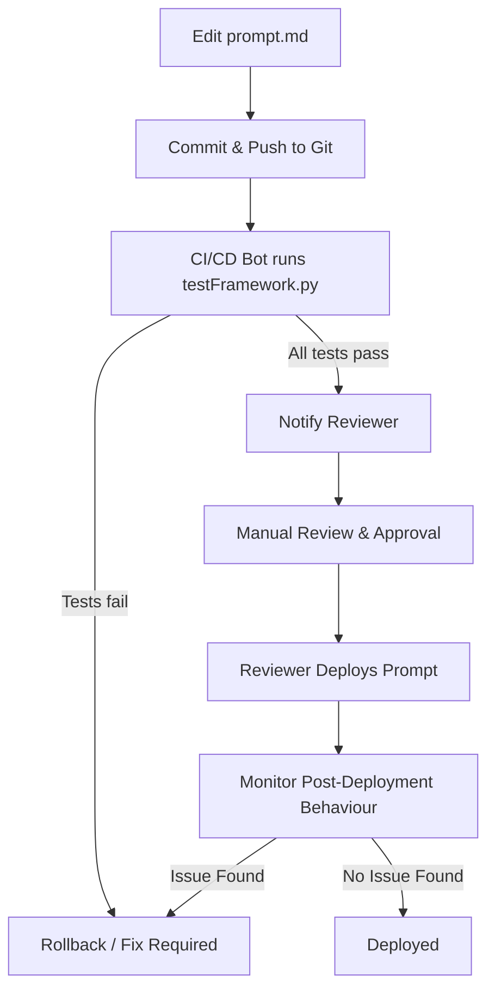

# Update Process for UniMarket Assistant

## 1. Purpose
This document describes how we maintain and update the **UniMarket Assistant** prompt in a controlled, safe, and auditable way.  
The process ensures:
- Updates are tested automatically but **deployed only after human review**.  
- Failed changes can be rolled back to the last stable version.  
- Sensitive policy updates get explicit approval.  

---

## 2. Roles & Responsibilities

| Role | Responsibility |
|------|----------------|
| **Author** | Edits `prompt.md`, documents rationale in `prompt-analysis.md`. |
| **Reviewer** | Reviews pull requests, checks test results, and validates compliance with policies. |
| **Maintainer** | Final approver who manually triggers deployment after successful tests. |
| **Automation Bot** | Detects prompt changes, runs `testFramework.py`, and notifies reviewers of pass/fail results. |

---

## 3. Files in the Update Flow

| File | Description |
|------|-------------|
| `prompt.md` | Core system prompt. |
| `prompt-analysis.md` | Rationale for updates. |
| `test-cases.json` | Golden tests for behaviour validation. |
| `testFramework.py` | Runs golden tests. |
| `automation-concept.py` | Detects changes, runs tests, and notifies reviewers. |
| `update-process.md` | (this file) Documentation of update workflow. |

---

## 4. Workflow

---
